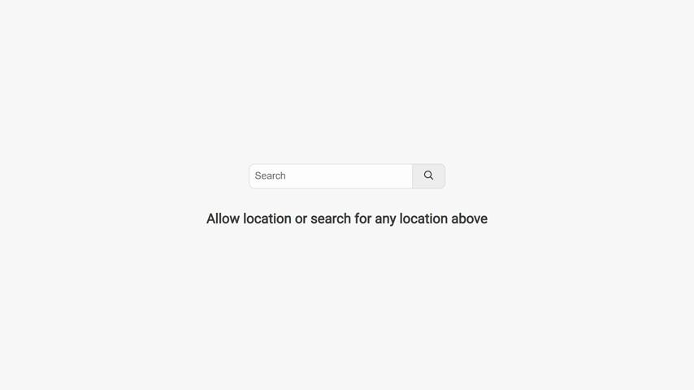

☁️ Weather API interaction
=========================

## Weather API interaction, using React and Typescript

A project interacting with a weather API and an API for converting citys names to coordinates.

In this project the user can allow their location to search for the weather in the current place.
or the user can search the weather anywhere in 
the world.

---------------------------

### How it works: 

